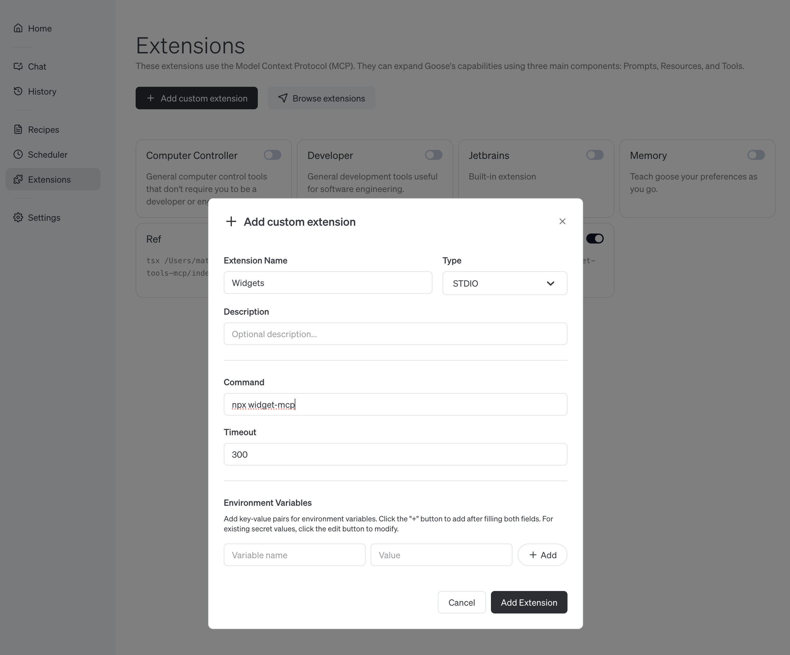

# ⚙️ Widget MCP

Add simple widgets to you LLM chat for common situations like timers, conversions and more.


Demo video: https://youtu.be/4gfom42vHkc

## Motivation

MCP-UI opens the door to [breaking the text wall](https://shopify.engineering/mcp-ui-breaking-the-text-wall) from chat UIs we've been using the last few years. The full extent of what's possible is 

This project shows the floor of what's possible by providing a few simple widgets for common situations.

If you've ever google "convert X to Y" or "2 minute timer" and see the custom UI results, this should feel very familiar.

## Current widgets

- `Timer` - Editable timer with a chime. 
- `Stopwatch` - Timer that just counts up.
- `Conversion` - Convert between set of units for which the LLM can write a formula. 
- `Display Fact` - When the answer is simple, just show it in an easy to read card.

## Supported MCP Clients

MCP-UI is new and as of August 2025 is only supported by a few clients. 

### Smithery

Try widget-mcp in the Smithery playground. (TODO: pending Smithery deploy)

### Goose

1. [Install Goose](https://block.github.io/goose/docs/quickstart)
2. Click `Extensions` and `Add custom extension`
3. Fill in name as `Widgets` and command `npx widget-mcp`
4. Verify it's working by clicking `Chat` and prompting `2 minute timer`




## Requests for widgets

Here's a few examples of widgets that could be fun to add.

- **Color Picker** - Interactive color selection and palette tools. Could be parameterized to allow the LLM to suggest a color and let the user tweak and explore.
- **Calculator** - Basic and scientific calculator functionality. Initial function seeded by LLM.
- **Dice Roller** - Custom set of dice based on what you ask the agent for.

I'm sure you have some cool ideas!

## Development

To add new widgets, add an template file to the `html` directory and a new tool to `index.ts`

```bash
# Install dependencies
npm install

# Iterate on the html with hot-reloads
npm run dev:html

# Launch the MCP server with Smithery's web inspector
npm run dev:mcp
```

## Links

- **[MCP-UI](https://mcpui.dev/)** - UI over MCP.
- **[Smithery](https://smithery.ai)** - Easiest way to find and try MCP servers.
- **[Goose](https://block.github.io/goose/)** - Block's opensource MCP client.
- **[PulseMCP](https://github.com/[placeholder]/pulsemcp)** - The best way to stay up-to-date on MCP.
- Maintained by **[Ref.](https://ref.tools)** - Context for your coding agent.
